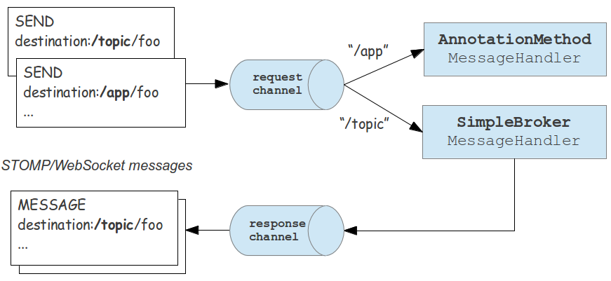
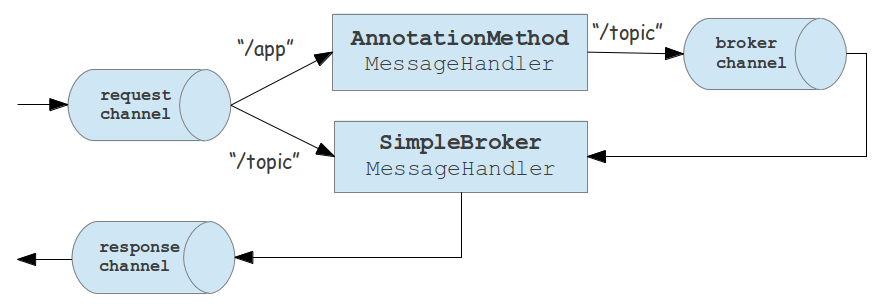

!SLIDE subsection
# STOMP over WebSocket (Spring Framework 4)

!SLIDE smaller bullets incremental
# STOMP Support in Spring

* Easy to enable
* Application becomes STOMP broker to Web clients
* Annotated message-handling methods
* "Simple" broker for pub-sub-
* ...or full-featured message broker

!SLIDE smaller bullets incremental
# New `spring-messaging` module

* Includes STOMP support and annotations
* Core types moved from Spring Integtation
* `Message`, `MessageChannel`, `MesageHandler`, etc
* Enables messaging architecture

!SLIDE smaller
# Configure STOMP o/r WebSocket

    @@@ java

    @Configuration
    @EnableWebSocketMessageBroker
    public class MyConfig implements WebSocketMessageBrokerConfigurer {

      @Override
      public void registerStompEndpoints(StompEndpointRegistry reg) {
        registry.addEndpoint("/portfolio"); // WebSocket URL prefix
      }

      @Override
      public void configureMessageBroker(MessageBrokerConfigurer conf) {
        conf.enableSimpleBroker("/topic/"); // destination prefix
      }

    }

!SLIDE smaller bullets incremental
# Peer-to-Peer Publish-Subscribe

* Clients can now subscribe
* Clients can send and receive messages from peers
* No server-side code required
* "Simple" broker does it

!SLIDE smaller bullets incremental
# Server-to-Client Publish-Subscribe

* Clients exchanging messages is useful, but-
* ...how to insert application logic, security, validation?
* We'll use annotated message-handling methods
* Then publish to subscribed clients

!SLIDE smaller
# Handling a Client Message

    @@@ java

    @Controller
    public class GreetingController {

      // Mapping based on "destination" header

      @MessageMapping("/greeting")

      public void greet(@MessageBody String greeting) {

      }

    }

!SLIDE smaller
# Handling a Client Message

    @@@ java

    @Controller
    public class GreetingController {

      // Mapping based on "destination" header

      @MessageMapping("/greeting")
      @SendTo("/topic/greetings")
      public String greet(@MessageBody String greeting) {
          return getTimestamp() + ": " + greeting;
      }

    }

!SLIDE smaller
# Configure Destination Prefixes

    @@@ java

    @Configuration
    @EnableWebSocketMessageBroker
    public class MyConfig implements WebSocketMessageBrokerConfigurer {

      @Override
      public void configureMessageBroker(MessageBrokerConfigurer conf) {
        conf.enableSimpleBroker("/topic/");
        conf.setAnnotationMethodDestinationPrefixes("/app");
      }

      // ...

    }

!SLIDE small center
# Message Handling
 

!SLIDE small center
# Sending Messages
 

!SLIDE smaller
# Send From Anywhere

    @@@ java

    @Controller
    public class GreetingController {

      // Send messages to broker channel

      @Autowired
      private SimpMessagingTemplate template;

      @RequestMapping(value="/greeting", method=POST)
      public void greet(String greeting) {
        greeting = getTimeStamp() + ":" + greeting;
        template.convertAndSend("/topic/greeting", greeting);
      }

    }

!SLIDE smaller bullets incremental
# Subscription Handling

* You can handle subscriptions
* And send data back (i.e. not involving the broker)
* Effectively request-reply message pattern
* _(in traditional messaging app, this would have been command + tmp queues)_

!SLIDE smaller
# Request-Reply Pattern

    @@@ java

    @Controller
    public class PortfolioController {

      @SubscribeEvent("/positions")
      public List<PortfolioPosition> getPositions(Principal user) {
        Portfolio portfolio = ...
        return portfolio.getPositions();
      }

    }

